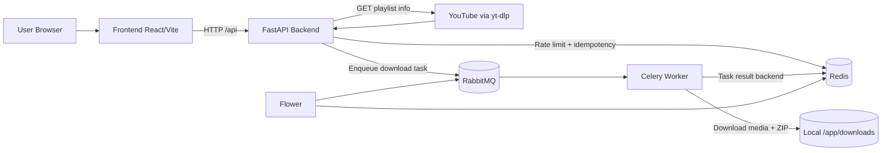

# Architecture

## High-Level View
The system is composed of five main runtime blocks:

- Client/UI (`front-end`, React + Vite)
- API (`back-end`, FastAPI)
- Queue/Broker (RabbitMQ)
- Async Worker (`worker`, Celery + yt-dlp)
- Data/Cache (Redis, plus MongoDB reserved for future persistence)

## Component Responsibilities
### Frontend
- Accepts user URL/search input
- Calls backend APIs through `/api`
- Renders playlist and selection UI

### FastAPI Backend
- Exposes API routes
- Extracts playlist metadata (`yt-dlp`)
- Enforces anti-abuse controls (IP validation, rate limiting, idempotency)
- Dispatches long-running downloads to Celery

### RabbitMQ
- Stores queued Celery jobs
- Decouples API response time from media processing time

### Celery Worker
- Consumes queued playlist-download jobs
- Downloads audio/media from selected links
- Packages content as ZIP archive

### Redis
- Stores rate-limiter token buckets
- Stores idempotency hashes
- Serves as Celery result backend

### MongoDB
- Provisioned in environment, currently not part of active request path

## Request and Processing Flow
1. User opens frontend and submits a YouTube playlist URL.
2. Frontend calls `GET /api/playlist/`.
3. Backend extracts playlist entries using `yt-dlp` and returns metadata + tracks.
4. User selects tracks and requests download.
5. Frontend calls `POST /api/playlist/download_playlist`.
6. Backend validates IP, rate limit, and idempotency in Redis.
7. Backend enqueues Celery task in RabbitMQ and returns `task_id`.
8. Worker consumes task, downloads files, creates ZIP, stores result path.

## Deployment Topology (Docker Compose)
- `frontend` container: Vite dev server on `5173`
- `backend` container: FastAPI app on `8000`
- `worker` container: Celery worker process
- `flower` container: Celery monitoring on `5555`
- `redis` container: cache/rate-limit/idempotency/result backend
- `rabbitmq` container: queue broker + management UI on `15672`
- `mongo` container: reserved persistence layer

## Diagram (Mermaid)

## Current Architectural Gaps
- No public endpoint yet to download produced ZIP file by `task_id`.
- No task-status polling endpoint integrated in frontend workflow.
- Search module exists in code layout but is not wired in active API routes.
- MongoDB is configured in infra but not yet used by domain models/services.
